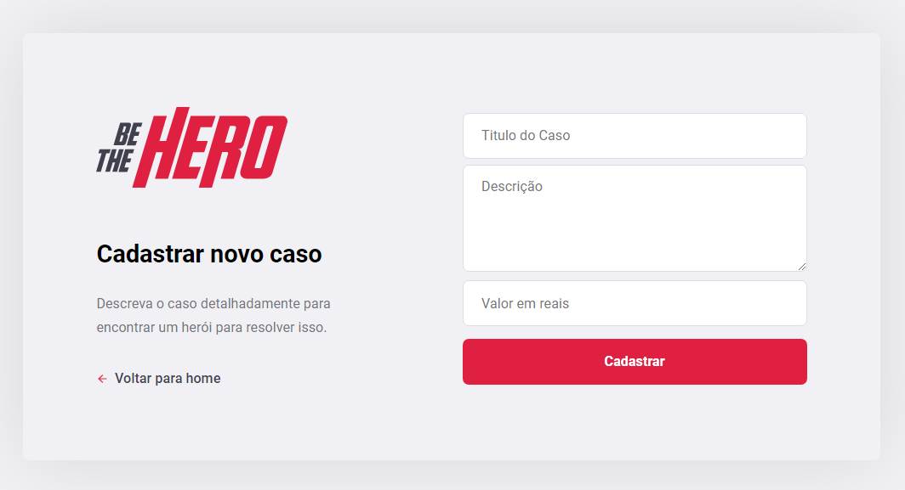

# *FRONT-END BE THE HERO*

 # Métodos HTTP:
 
 * GET: Buscar uma informação do back-end
 * POST: Criar alguma informação no back-end
 * PUT: Alterar uma informação no back-end
 * DELETE: Deletar uma informação no back-end
 

 
  # Tipos de parâmetros
  * Query Params: Parâmetros nomeados enviado na rota após "?" (Filtros, paginação)
  * Route Params: Parêmtros utilizados para identificar recursos
  * Request Body: Corpo da requisição, utilizado para criar ou alterar recursos

  ### Ferramentas utilizadas nesta aplicação:
* NodeJs
* ReactJs

    * Depedências:
        * axios
        * react
        * react-dom
        * react-icons
        * react-router-dom
    

### *Banco de dados usado foi `SqlLite`*

# Instruções para executar Back-End
  
  Após baixar a pasta _`front-end`_, na pasta raiz da aplicação, caso esteja usando o [ Visual Studio Code ] abrir o terminal e executar o seguinte o comando abaixo para instalar os modulos necessário `npm install` para instalar todas as depedências que foram usadas.

Após rodar o comando acima, no terminal do [ Visual Studio Code ] rodar o seguinte comando _`npm start`_.

_` Com o comando acima, a aplicação vai start o servidor. E aguadando um pouco, uma aba no seu navegador irá abrir com o endereço http://localhost:3000`_

# Tela de Cadastro da ONG:

# Tela de Login da Aplicação:

# Tela de Cadastro do Caso:

