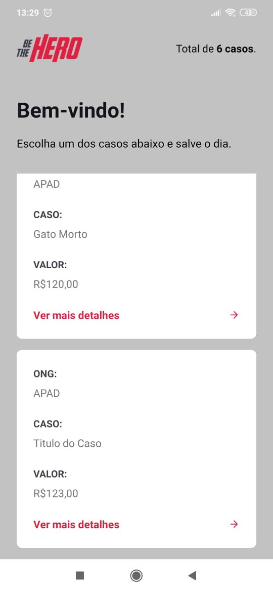
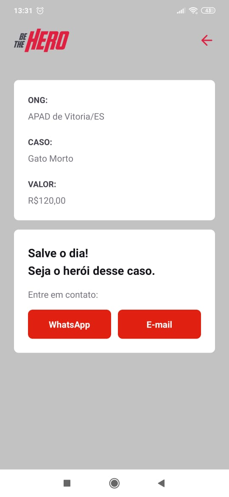

# *MOBILE BE THE HERO*

O intuito do App, é quem queira ajudar em alguns dos casos cadastrado pela ONG.

Podem verificar os casos cadastrados, e quando clica no botão para verificar o detalhe do caso, e se a pessoa se interessar em ajudar mesmo. Pode clicar no botão WHATSAPP que o aplicativo WHATSAPP vai abrir para mandar mensagem. Ou se clicar no botão enviar EMAIL, o aplicativo irá abrir o aplicativo para envio do e-mail.
 

 
 ### Ferramentas utilizadas nesta aplicação:
* React Native

    * Depedências:
        * axios
        * expo
        * expo-constants
        * expo-mail-composer
        * intl

    

### *A API busca os dados no banco de dados `SqlLite` onde os dados são cadastrado através do FRONT-END*

_` O APP foi desenvolvido usando o REACT NATIVE + EXPO `_

# Tela de de Carregamento do APP:

# Tela de Login da Aplicação:

# Tela de Cadastro do Caso:

